# Saber-Theme

> **About this project:** all of the code was written by Claude (Anthropic's AI model, via Claude Code). Platinum-Saber provided the design decisions and architecture rules, and reviewed and approved every plan before it was implemented.

A custom Android home-screen launcher with liquid-glass styling and an interactive Saber mascot, built with Kotlin and Jetpack Compose for the Galaxy S23 (Android 16, One UI 8.5).

## Showcase
Captured on a Galaxy S23. The wallpaper in these captures is Pinterest fan art (see [Credits](#credits)).

### The mascot

  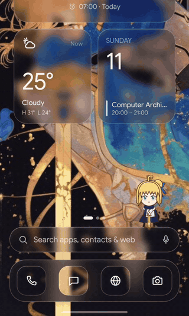
  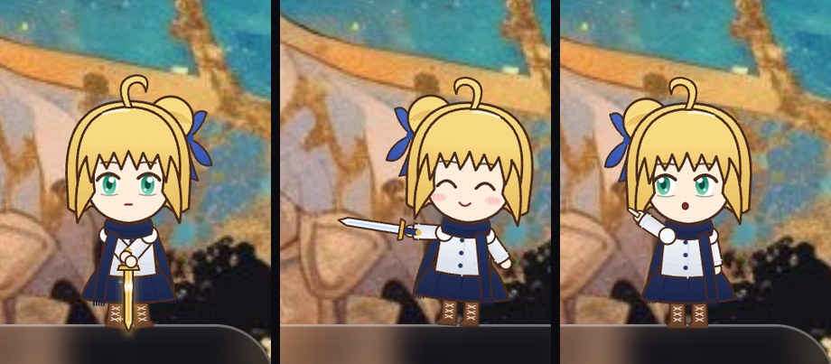

Poke her, long-press her, drag and throw her. A finger near her gets a playful sword duel; one far away gets a look and a point. While the phone charges she stands guard and her sword glows gold. She also has idle moments, wanders, sleeps after a quiet minute, and dances while music plays.

### Unread messages
| Message cloud | Preview (names and messages blurred) |
|---|---|
| 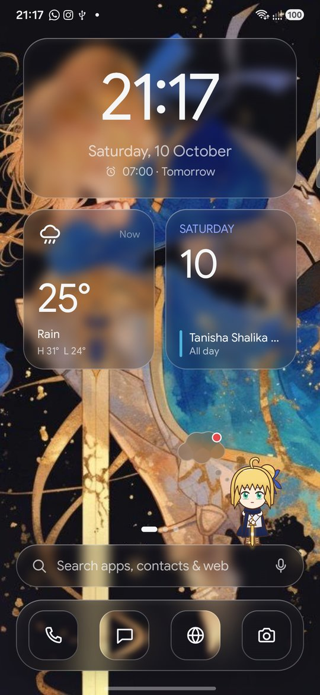 | 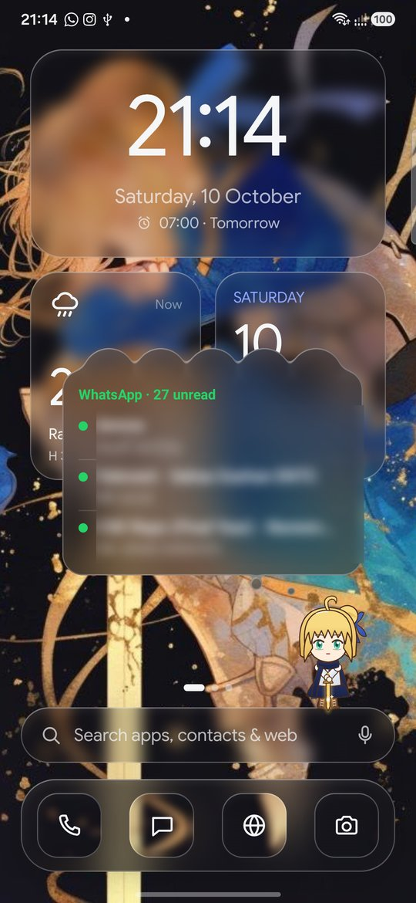 |

A glass thought cloud with a red dot appears beside her while WhatsApp chats are unread. Tap it for a preview of the latest chats, tap a chat to open it, or flick the cloud away to dismiss them. It hides while the screen is recorded.

### Home, drawer and search
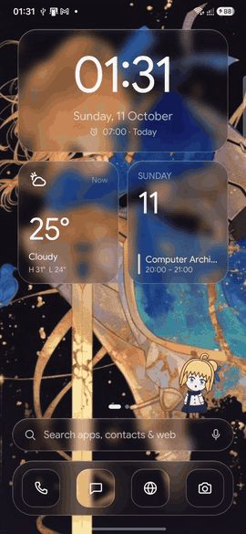

| Home | Media widget | Apps and folders | Folder |
|---|---|---|---|
| 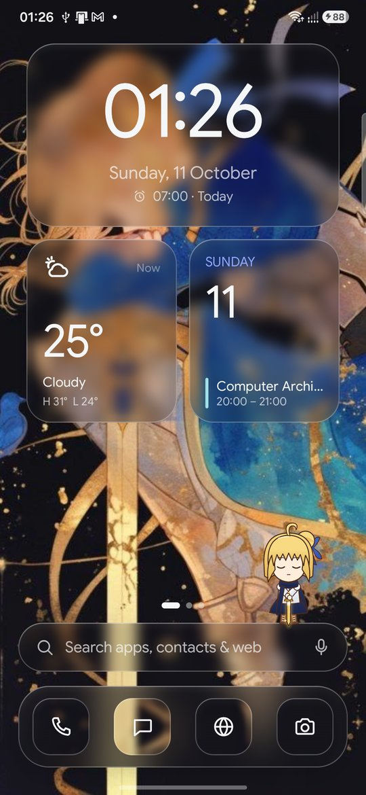 | 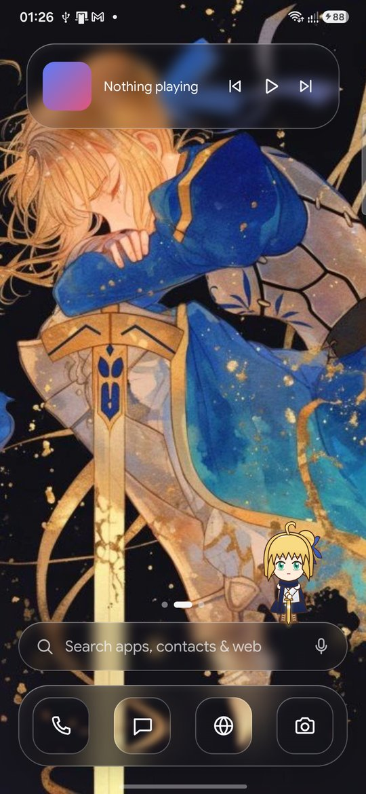 | 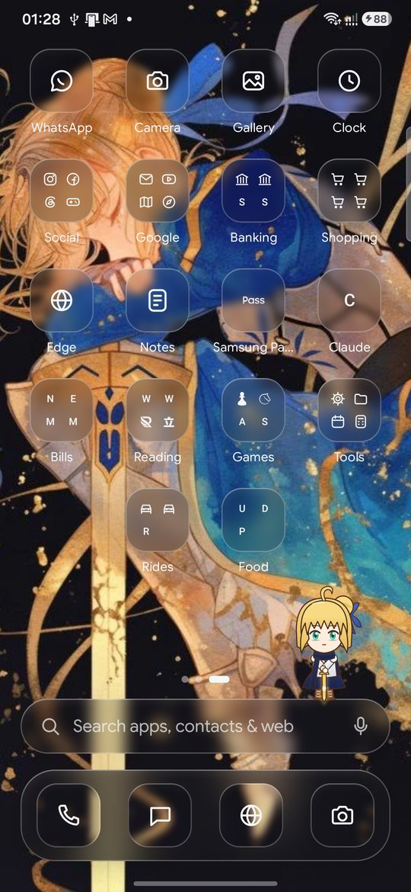 | 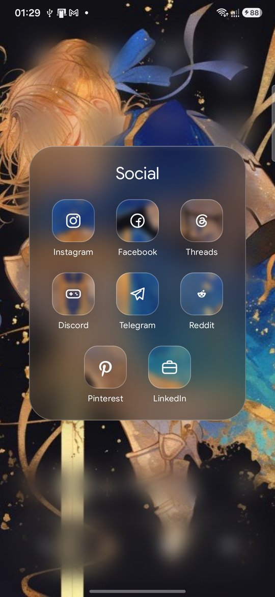 |

| App drawer | Search | Home menu | Edit mode |
|---|---|---|---|
| 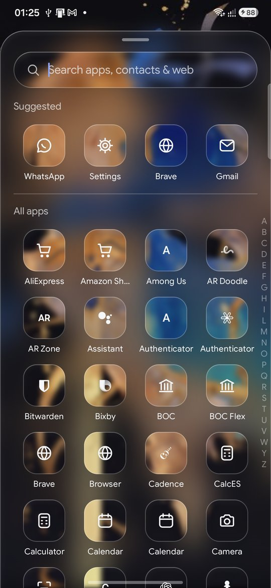 | 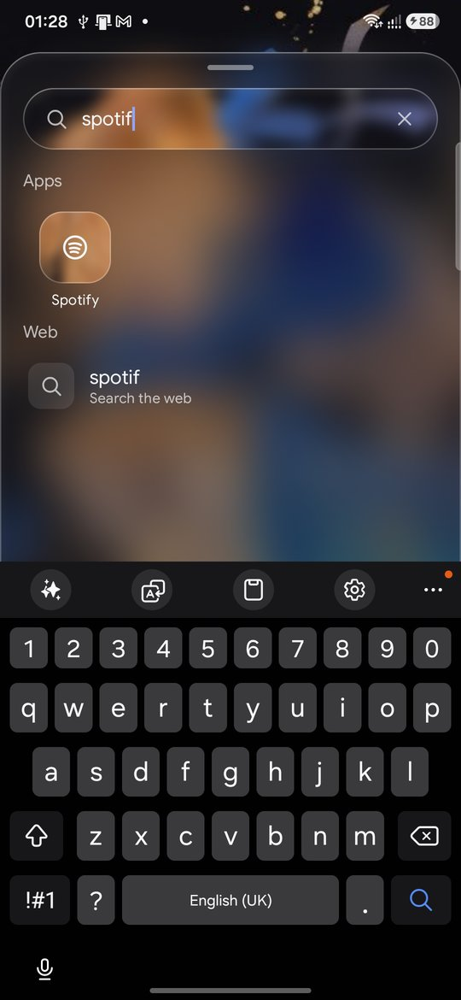 | 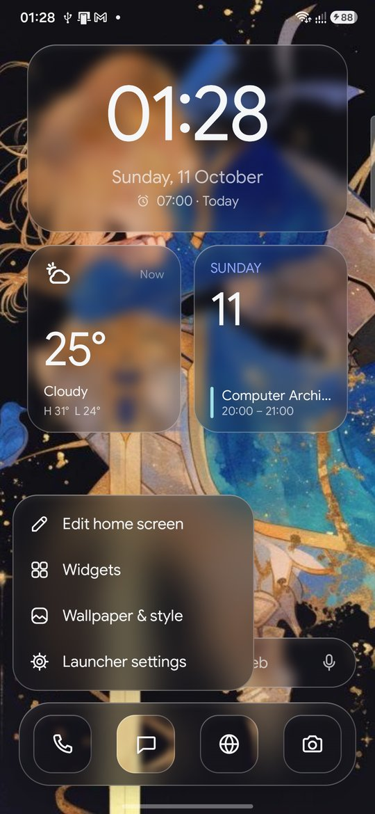 | 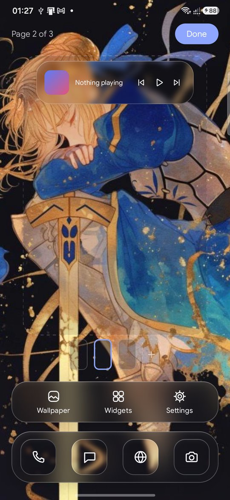 |

### Widgets and settings
| Widget picker | Settings | More settings |
|---|---|---|
| 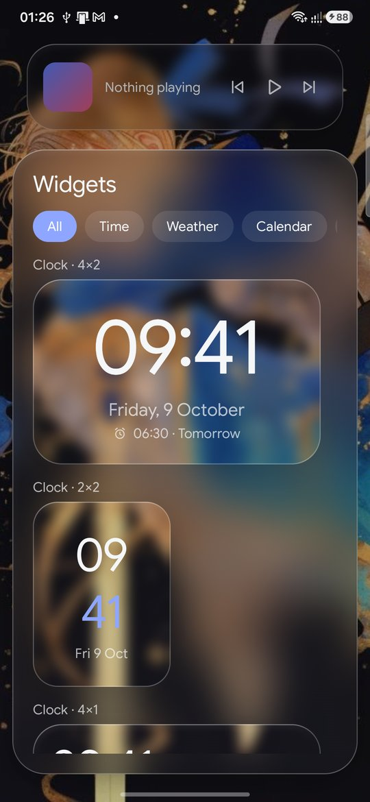 | 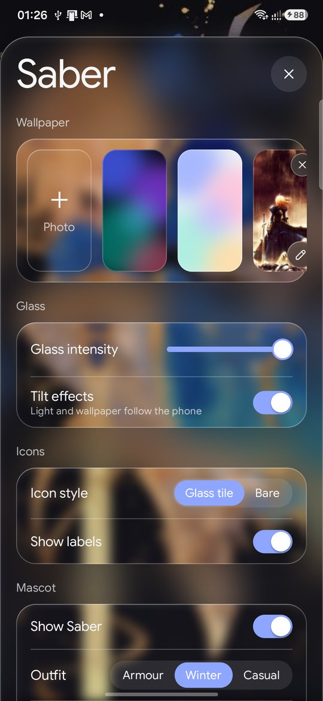 | 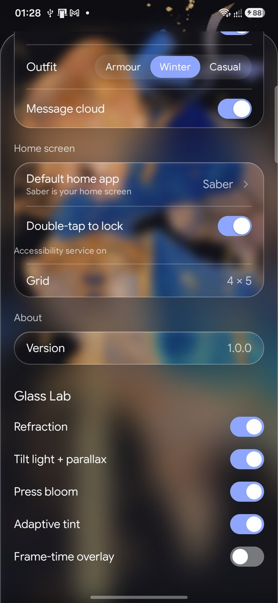 |

Every panel is liquid glass: it samples a blurred copy of the wallpaper, refracts at the edges, and has a rim lit by the phone's tilt, which also moves the wallpaper.

## Install
Download `Saber-1.0.0.apk` from [Releases](https://github.com/Platinum-Saber/Saber-Theme/releases), install it, then choose Saber as the default home app.

## Docs
- [Architecture](docs/architecture.md)
- [Security](docs/security.md)

## Credits
- **Fate series:** Saber (Artoria Pendragon) and the Fate series belong to TYPE-MOON. They inspired the launcher's theme and its mascot. This is an unofficial fan project, not affiliated with or endorsed by TYPE-MOON. The mascot is an original drawing made in code; no official artwork is included.
- **Pinterest artwork:** Saber fan art and chibi illustrations on Pinterest were the style references for the mascot and theme, and were used as wallpapers during development. All rights stay with their artists. One such wallpaper appears in the screenshots and recordings in `docs/media`; it isn't part of the app or its releases.

## License
Licensed under the [Apache License 2.0](LICENSE): anyone may use, modify and share this project, including commercially, as long as they credit Platinum-Saber and keep the [NOTICE](NOTICE) file. The license covers this repository's code and original assets only, not Fate characters, TYPE-MOON trademarks or third-party art (including the wallpaper visible in `docs/media`).
