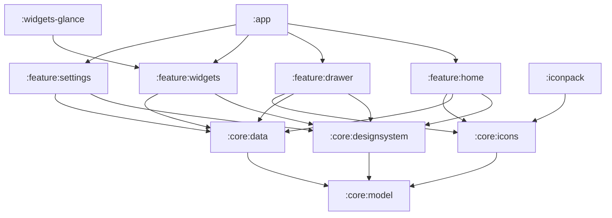

# Saber-Theme architecture

Minimalist "liquid glass" home-screen launcher for the Galaxy S23 (API 36,
One UI 8.5), with themed widgets and a matching icon pack. Kotlin + Jetpack
Compose, Hilt, coroutines/Flow, Gradle version catalog.

## Product decisions
- The launcher **draws its own wallpaper**, so every glass element can blur
  and refract what is behind it.
- Widgets: **native Compose glass widgets** inside the launcher, plus
  **Glance widgets** exported for other launchers (frosted-tint fallback,
  since RemoteViews cannot blur).
- Icons: **built in**, plus a standalone **icon-pack APK** in the ADW/Nova
  `appfilter.xml` format.

## Modules

| Module | Responsibility |
|---|---|
| `:app` | `HomeActivity` (MAIN/HOME, `singleTask`), nav host, Hilt root, wiring |
| `:core:designsystem` | Tokens, `GlassSurface`, typography, AGSL shaders, theme |
| `:core:model` | Pure Kotlin: `AppEntry`, `HomeLayout`, `WidgetSpec`, `IconMapping` |
| `:core:data` | DataStore (layout, prefs), `AppRepository` (LauncherApps), wallpaper store |
| `:core:icons` | Vector glyphs, `ComponentName` → glyph map, monochrome fallback |
| `:feature:home` | Pager, grid, dock, edit mode, folders |
| `:feature:drawer` | App drawer and search |
| `:feature:widgets` | Native widget composables and `WidgetDataSource` implementations |
| `:feature:settings` | Wallpaper, glass intensity, grid size, icon options |
| `:widgets-glance` | Exported AppWidgets (Glance), reusing the widgets data layer |
| `:iconpack` | Separate `applicationId` APK; `appfilter.xml` generated from `:core:icons` |

**Dependency rule:** `feature:*` → `core:*` only. Features never depend on
each other; `:app` composes them. (`:widgets-glance` depends on the data
layer of `:feature:widgets`; if that grows, move the sources to
`:core:widgetdata`.)

## Layers
- Unidirectional data flow: Composable ← `StateFlow<UiState>` (ViewModel)
  ← repositories ← sources.
- Persistence: DataStore for layout and settings. One UI may kill or reset
  the launcher, so no state lives only in memory.
- Apps: `LauncherApps` + `LauncherApps.Callback` → `AppRepository`, so work
  profile and Secure Folder apps appear (see `.claude/rules/launcher-manifest.md`).

## Glass rendering pipeline
The main technical risk; constraints live in `.claude/rules/glass-rendering.md`.

1. `WallpaperLayer` at the root draws the wallpaper bitmap (bundled abstract
   wallpapers or a photo-picker image), with light parallax on page scroll.
2. A **blurred copy** of the wallpaper is computed once per wallpaper change
   and cached; glass surfaces sample it instead of blurring live.
3. `GlassSurface(shape, material)` samples the backdrop region under its
   bounds and runs an AGSL `RuntimeShader` (API 33+) for edge refraction,
   specular rim highlight, tint and border.
4. Material tokens: `blurRadius`, `tint`, `tintAlpha`, `refraction`,
   `highlight`, `borderAlpha`; presets `thin`, `regular`, `thick`.
5. Engine: **own AGSL shader** (spike 2026-10-09, `benchmark` build on the
   S23, 20 Thin tiles + Regular widget + Thick dock, pager swipes):
   frame p50 5 ms / p90 6 ms / p95 6 ms, GPU 3 ms, jank 1.5% (slow UI
   thread frames; target < 1% is a home-screen task). Kyant `backdrop` was
   not benchmarked: it records and blurs content live each frame, which the
   cached-backdrop rule rules out. Revisit only for live overlay blur.
   Real home (step 6, 7 pages, ~25 glass nodes on screen, labels, tilt,
   adaptive tint): p50 7 ms / p90 9 ms, jank 2.3%. Every glass node must
   re-record each frame while paging (its backdrop offset changes), so
   per-node CPU cost is the budget; uniforms are pushed only on change and
   tint solves are cached. Remaining jank is mostly page composition on
   swipe; target < 1% is open.
6. Glance fallback maps the same tokens to a translucent tinted rounded
   background with a 1 px border.

## Widget system
- `WidgetDataSource<T>` exposes `Flow<WidgetState<T>>` (Loading, Ready,
  NeedsPermission, Error).
- Sizes on the cell grid: 2×1, 2×2, 4×1, 4×2.
  `WidgetSpec(type, size, position, config)` is stored in the layout.

| Widget | Source | Permission / access |
|---|---|---|
| Clock | system time ticker | none |
| Date / Calendar | `CalendarContract` | `READ_CALENDAR` |
| Weather | Open-Meteo (no API key) | `ACCESS_COARSE_LOCATION`, `INTERNET` |
| Battery | sticky `ACTION_BATTERY_CHANGED` | none |
| Media | `MediaSessionManager` | notification listener access |
| Next alarm | `AlarmManager.nextAlarmClock` | none |

Glance widgets reuse the same sources, refreshed by WorkManager plus
broadcast triggers (time, battery, alarm changed).

## Icon system
- Glyphs drawn in Figma on a 24-unit grid (1.75 stroke, round caps),
  exported as SVG and converted to VectorDrawables in `:core:icons`.
- Rendering: glyph centred on a glass squircle, or bare-glyph mode.
- Lookup order: mapped glyph → adaptive-icon monochrome layer → generated
  letter glyph.
- `:iconpack` packages the same drawables with generated `appfilter.xml`
  and `drawable.xml`.

## Design source
The Figma file "Saber-Theme" (Foundations, Components, Widgets, Icon pack,
Screens) is the visual source of truth. Frames are 360×780 dp (S23 at ~3x).
