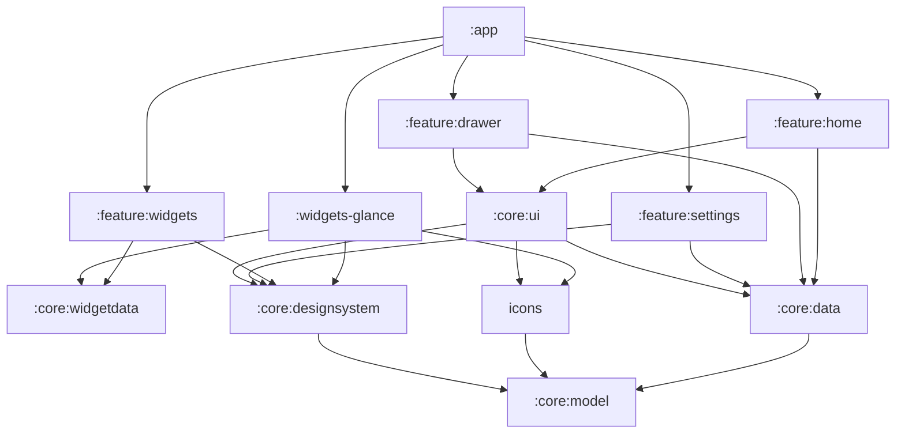

# Saber-Theme architecture

Minimalist "liquid glass" home-screen launcher for the Galaxy S23 (API 36,
One UI 8.5), with themed widgets and a matching icon pack. Kotlin + Jetpack
Compose, Hilt, coroutines/Flow, Gradle version catalog.

## Product decisions
- The launcher **draws its own wallpaper**, so every glass element can blur
  and refract what is behind it.
- Widgets: **native Compose glass widgets** inside the launcher, plus
  **Glance widgets** exported for other launchers (frosted-tint fallback,
  since RemoteViews cannot blur).
- Icons: **built in**, plus a standalone **icon-pack APK** in the ADW/Nova
  `appfilter.xml` format.

## Modules



| Module | Responsibility |
|---|---|
| `:app` | `HomeActivity` (MAIN/HOME, `singleTask`), Hilt root; hosts Home + overlays (drawer, widget picker, settings) as state, no nav library |
| `:core:designsystem` | Tokens, `GlassSurface`, typography, AGSL shaders, theme, `GlassSheet` / `GlassSlider` / `GlassSwitch` |
| `:core:model` | Pure Kotlin: `AppEntry`, `HomeLayout` (`HomePage`, `Placed`, `HomeItem`, `WidgetType`), `DragSource` / `DropTarget`, `HomeLayoutPolicy`, codec, `GlassSettings` |
| `:core:data` | DataStore (layout, settings, `LaunchStats`), `AppRepository` (LauncherApps, launch, uninstall), `HomeRepository`, wallpaper store |
| `:core:icons` | Vector glyphs, `ComponentName` → glyph map, monochrome fallback, `GlyphImages` cache |
| `:core:ui` | Shared app UI: `AppTile` / `HomeAppIcon` / `FolderIcon` (+ `LocalIconAppearance`), `GlassMenu`, `LauncherApp`, `AppIconResolver`, `AppLauncher`, `AppActions` (app long-press menu) |
| `:feature:home` | Pager, grid, dock, folders, edit mode (drag and drop) |
| `:feature:drawer` | App drawer and universal search |
| `:core:widgetdata` | Widget data layer shared by in-launcher and exported widgets: `WidgetDataSource` implementations, `WidgetState`, `WidgetPermissions`, `WidgetSources`, Open-Meteo, `WidgetFormat`, `MediaListenerService` |
| `:feature:widgets` | Native glass widget UI (`WidgetViews`, `WidgetHost`), `WidgetCatalog`, widget picker |
| `:feature:settings` | Settings page: wallpaper, glass, icons, default home, about |
| `:widgets-glance` | Exported AppWidgets (Glance) merged into the launcher APK, reusing `:core:widgetdata` |
| `:iconpack` | Separate APK (`com.sabertheme.iconpack`), no module dependencies; resources generated by `tools/build-iconpack.mjs` |

**Dependency rule:** `feature:*` → `core:*` only. Features never depend on
each other; `:app` composes them. The widget data layer lives in
`:core:widgetdata` so the in-launcher widgets and the exported Glance
widgets share it.

## Layers
- Unidirectional data flow: Composable ← `StateFlow<UiState>` (ViewModel)
  ← repositories ← sources.
- Persistence: DataStore for layout and settings. One UI may kill or reset
  the launcher, so no state lives only in memory.
  - `SettingsRepository`: `GlassSettings` = intensity, `WallpaperChoice`
    (`Bundled(id)` | `Photo(fileName)`), `iconStyle` (Tile | Bare),
    `showLabels`, `tiltEnabled`.
  - `LaunchStats`: launch counts per app (top 64), recorded by
    `AppLauncher`, read by the drawer's Suggested row.
  - `LayoutRepository`: `HomeLayout(dock, pages: List<HomePage>)`, each
    page a list of `Placed(item, col, row, spanX, spanY)` with
    `HomeItem.App | Folder | Widget(widgetId, WidgetType, config)`, in the
    line-based `HomeLayoutCodec` v2 format. v1 (M1) layouts migrate on read:
    dock kept, first page placed in reading order, default widget page
    prepended, later pages dropped (those apps live in the drawer).
  - `WallpaperStore`: imported photos copied to `filesDir/wallpapers` as
    WebP (long edge <= 3072 px); the picker grant is temporary.
- `HomeLayoutPolicy` (pure Kotlin, tested) builds the curated first-run
  layout: dock from phone/messages/browser/camera glyphs; page 1 widgets
  (Clock 4x2, Weather 2x2, Calendar 2x2, Battery 2x1, Alarm 2x1; Media is
  picker-only since it needs listener access); page 2 a Social folder + up
  to 15 apps from `USEFUL_GLYPHS`. `reconcile` only removes uninstalled
  apps (never appends, never adds or removes pages) and keeps apps of
  locked/paused profiles (`AppRepository.Installed.lockedProfiles`). Edit
  operations: `drop(layout, DragSource, DropTarget)` (cell, dock slot, onto
  an app or folder, Remove; returns the layout unchanged when not allowed),
  `add` / `firstFreeSpot` (new widgets, "Add to home"), `removeApp`,
  `renameFolder`, `addPage`, `removePage` (empty pages only).
- Apps: `LauncherApps` + `LauncherApps.Callback` → `AppRepository`, so work
  profile and Secure Folder apps appear (see `.claude/rules/launcher-manifest.md`).

## Glass rendering pipeline
The main technical risk; constraints live in `.claude/rules/glass-rendering.md`.

1. `WallpaperLayer` at the root draws the wallpaper, offset by parallax.
   Aurora Night/Dawn are drawn procedurally from the Figma blob recipe at
   window size + 28 dp overscan; photos are centre-cropped to the same size.
2. `GlassBackdrop.render` (off the main thread, once per wallpaper and
   window size) downsamples 4x and box-blurs one copy per material, and
   builds a `WallpaperPalette` (12x26 luminance/colour grid). Photos get the
   dark theme when their mean luminance is below 0.25.
3. `GlassSurface(shape, material, onClick, onLongClick)` is a
   `Modifier.Node` that tracks its window position and runs one AGSL
   `RuntimeShader` (API 33+) pass over its own bounds: rounded-rect SDF,
   edge refraction into the blurred copy, adaptive tint, lit specular rim,
   border and press bloom. Uniforms are pushed only when they change.
4. Material tokens: `blurRadius`, `tint`, `tintAlpha`, `refraction`,
   `highlight`, `borderAlpha`; presets `thin`, `regular`, `thick`.
5. Engine: **own AGSL shader** (spike 2026-10-09, `benchmark` build on the
   S23, 20 Thin tiles + Regular widget + Thick dock, pager swipes):
   frame p50 5 ms / p90 6 ms / p95 6 ms, GPU 3 ms, jank 1.5% (slow UI
   thread frames; target < 1% is a home-screen task). Kyant `backdrop` was
   not benchmarked: it records and blurs content live each frame, which the
   cached-backdrop rule rules out. Revisit only for live overlay blur.
   Real home (step 6, 7 pages, ~25 glass nodes on screen, labels, tilt,
   adaptive tint): p50 7 ms / p90 9 ms, jank 2.3%. Every glass node must
   re-record each frame while paging (its backdrop offset changes), so
   per-node CPU cost is the budget; uniforms are pushed only on change and
   tint solves are cached.
   M2 step 1 (Perfetto + simpleperf, same 7-page layout, 12 swipes):
   - Compiled shaders come from a process-wide pool (`GlassPrograms`,
     pre-warmed with 56 off the main thread in `BackdropLoader`); compiling
     AGSL per new tile cost ~0.5 ms each on a page's first frame.
   - Glyphs draw from `GlyphImages` (rasterised once per size) instead of
     `painterResource` vectors, which re-rasterised per composition.
   - `GlassSurface` layers: `dropShadow → [layer] glass → [layer] content`,
     so the per-frame parallax re-record touches only the glass rect.
   - Result: p50 5–6 ms / p90 7–8 ms / p99 10–13 ms, GPU 3 ms, jank
     1.0–1.3% (was 2.2%). Every remaining slow frame is the first frame of a
     swipe, when the incoming page records for the first time (~7.5 ms for
     20 cells, ~350 µs each, spread across Compose node draw). Keeping
     neighbours composed (`beyondViewportPageCount = 1`) made it worse
     (1.9%): the spike moves to mid-swipe and off-screen glass re-records.
     Step 2 (2-page curated home, placeholder widgets): jank 0.2–0.3%,
     p90 6 ms; most of the 12 swipes now hit the edge.
     Step 4 (live widgets on page 1, 12 swipes): jank 1.09%, p50 6 ms /
     p90 8 ms / p99 15 ms, GPU p90 4 ms. Reported, not tuned: perf work
     was closed for M2.
   - The `benchmark` build is profileable and not obfuscated
     (`app/src/benchmark`, `benchmark-rules.pro`) for `simpleperf --app`.
6. Glance cannot blur: `GlanceTokens` map the glass tokens to a translucent
   rounded fill (`glance_fill`, light `#99FFFFFF`, dark `#B31A1C22`) with a
   1 dp border (see "Exported widgets").

## Living glass
The glass reacts to touch, tilt, motion and what is behind it, without
being busy or costly.

1. **Glass answers every touch.** `Modifier.glassPress`: press compresses
   (spring, 4%), light blooms from the finger in the shader, haptic tick;
   release overshoots slightly (`GlassMotion.release`, damping 0.6).
2. **Light comes from the world.** `TiltSensor` (game rotation vector,
   `SENSOR_DELAY_GAME`, low-pass, slowly drifting rest pose) moves the
   virtual light, which drives the rim highlight, and adds tilt parallax.
3. **Nothing teleports.** Every change uses a `GlassMotion` spring: folders
   grow from their tile, menus from the touch point, sheets from below.
4. **Glass adapts to what's behind it.** `TintSolver` picks the lowest tint
   alpha that keeps primary text >= 4.5:1 over the palette sample under each
   surface (results cached per quantised rect).
5. **Alive, never busy.** `EffectsPolicy` (pure Kotlin, tested) is Active
   only within 3 s of a touch while resumed; Idle keeps tilt following at
   `SENSOR_DELAY_UI` (~15 Hz) while home is visible (off when paused);
   `TiltFilter` smooths by time, survives rate switches, and skips changes
   below a deadband so a still phone doesn't redraw home;
   Power Saving / thermal >= moderate halve effects and turn the sensor
   off; "Remove animations" snaps springs. The user intensity slider scales
   refraction, rim and bloom.
6. **Draw-phase only.** Tilt, parallax, press and intensity are snapshot
   state in `GlassEnvironment` / `GlassPressState`, read only in draw,
   `graphicsLayer` or node draw code, so motion never recomposes.

```
GlassEnvironment (CompositionLocal, HomeActivity root)
 ├─ backdrop      ← BackdropLoader(BackdropSource.Aurora | Photo)
 ├─ light         ← TiltSensor
 ├─ parallax      = tiltParallax + pageParallax (clamped to overscan)
 ├─ intensity     ← GlassEffectsController(EffectsPolicy, user slider)
 ├─ reducedMotion ← ANIMATOR_DURATION_SCALE == 0
 └─ effects       ← Glass Lab switches (debug and benchmark builds)
```

Overlays (open folder, drawer, settings) blur the home content with a
layer `BlurEffect` only while visible (`HomeScreen(backgroundBlur)` reads
the drawer/settings progress in the layer block); glass itself never
blurs live. The Tilt effects setting maps onto `env.effects.tilt`.

## Home
- `HomeScreen`: pager of positioned 4x5 grids (`HomeGrid`: 72 dp app cells
  spread edge to edge, 56 dp tiles, 18 dp margin; widgets align with the
  tiles' outer edges with 12 dp gaps), morphing page indicator, search
  pill, Thick dock of up to four apps. Widgets render through the
  `widgetContent(widget, size, modifier)` slot, which `:app` fills with
  `WidgetHost`.
- Swipe up anywhere, or tap the search pill, opens the drawer
  (`onOpenDrawer(withKeyboard)`). The Home button (`onNewIntent`) closes
  the drawer, picker and settings and leaves edit mode.
- Long-press empty space: Edit home screen, Widgets (picker), Wallpaper &
  style and Launcher settings (both open Settings). Long-press an app: the
  `AppActions` menu (Remove from home, App info, Uninstall for
  user-installed apps).
- Launch: `AppLauncher` → `LauncherApps.startMainActivity` with a
  clip-reveal from the icon's window bounds; counts the launch.
- Home is curated; every app lives in the drawer. Apps of a locked profile
  keep their slot and are hidden until it unlocks.

### Edit mode
- Enter from the menu, or long-press an app, folder or widget and drag (the
  item's menu closes as the drag starts). The pager scales to 0.8 inside a
  dashed outline; top bar "Page X of N" + Done; page thumbnails with a "+"
  page (long-press a thumbnail and drag it sideways to reorder pages,
  `HomeLayoutPolicy.movePage`; the page on screen keeps its content); toolbar
  Wallpaper / Widgets / Settings. Empty pages show "Remove
  empty page". Back, Done or Home leaves edit mode.
- `DragState`: items opt in with `Modifier.pickup` (in edit mode a move past
  touch slop picks up; otherwise long-press first). The root `dragTracker`
  then owns the pointer in the Initial pass, moves the ghost (`DragLayer`,
  a lifted copy drawn in a layer) and resolves the target against the
  registered page, dock and Remove-zone coordinates: a free cell (widgets
  keep their span), the centre of an app or folder (folder), a dock slot,
  or Remove. A dashed outline previews the target. Resting at a screen edge
  flips the page.
- Release commits through `HomeViewModel.drop` → `HomeLayoutPolicy.drop`;
  the layout shows at once through a `pending` override that clears when
  `LayoutRepository` catches up. The ghost springs (`GlassMotion.morph`)
  into its slot, into the folder or Remove zone, or back home when the drop
  is refused. Haptics on pick-up, drop and refusal.
- Open folders: drag an app out to move it (a folder left with one app
  becomes that app); the title is editable while editing.

## Drawer and search
- `AppDrawer` (`:feature:drawer`): full-height Thick glass sheet with a
  handle, search field, Suggested row (top 4 by `LaunchStats`), "All apps"
  A–Z grid (locale collation) and an alphabet rail with haptic ticks. Drag
  the header, or pull past the top of the list, to close; Back and Home
  close it. Long-press an app: Add to home (first free spot from the apps
  page, new page if full), App info, Uninstall.
- Universal search, debounced 120 ms, sections Apps / Contacts / Settings /
  Web. `AppSearch` ranks exact > prefix > word start or initials >
  substring > fuzzy subsequence on the label, with the package one notch
  lower (boilerplate segments ignored, never fuzzy). Contacts use the
  provider's filter URI behind an inline "Search contacts" permission row.
  `SettingsSearch` matches every query word against the titles and keywords
  of a built-in `Settings.ACTION_*` list. The IME Search key opens the top
  result.

## Settings
- `SettingsScreen` (`:feature:settings`): full-screen Thick glass page
  (Figma "Settings") with groups Wallpaper (bundled + imported photos),
  Glass (intensity slider with live preview, tilt), Icons (Glass tile /
  Bare, labels), Home screen (default home via `RoleManager.ROLE_HOME`,
  grid) and About (version; Glass Lab in debug and benchmark builds).
- Icon style and labels reach every surface through `LocalIconAppearance`
  (`:core:ui`), provided at the root. Bare draws the glyph without glass at
  30/56 of the tile size; folders keep their glass.

## Widget system
- `WidgetDataSource<T>` exposes `Flow<WidgetState<T>>` (Loading, Ready,
  NeedsPermission, Error). Each source is a `@Singleton` whose flow is
  shared in `WidgetScope` with `WhileShown` (5 s stop timeout), so a widget
  on screen keeps one receiver or observer and nothing runs while home is
  stopped. `WidgetSources` bundles them; `:app` injects it once. Readers
  outside composition use `snapshot()` (first non-Loading state, 20 s cap).
- `WidgetPermissions.gated(permission)` emits NeedsPermission until granted
  and restarts the source when a grant appears (`recheck()` on resume and
  after the permission result). The widget shows "Allow", which asks at
  runtime, opens app info after a permanent denial, or opens
  notification-listener settings.
- Sizes on the cell grid: 2×1, 2×2, 4×1, 4×2.
  `HomeItem.Widget` + its `Placed` span is stored in the layout;
  `WidgetType.sizes` lists the allowed sizes (first = default).
  `WidgetViews.kt` draws each type per size (Figma "Widgets" board).

| Widget | Source | Permission / access |
|---|---|---|
| Clock | `ACTION_TIME_TICK` / time / zone broadcasts | none |
| Calendar | `CalendarContract.Instances`, next 7 days, observer + 5 min ticks | `READ_CALENDAR` |
| Weather | Open-Meteo (no API key) at a coarse fix; JSON cached 30 min in DataStore `weather` | `ACCESS_COARSE_LOCATION`, `INTERNET` |
| Battery | sticky `ACTION_BATTERY_CHANGED` | none |
| Media | `MediaSessionManager` + `MediaListenerService`; play/pause/skip | notification listener access |
| Next alarm | `AlarmManager.nextAlarmClock` + `ACTION_NEXT_ALARM_CLOCK_CHANGED` | none |

- `WidgetCatalog` (title, category, permission) and `WidgetPreview` (sample
  data) feed `WidgetPicker`: category chips, every type at every size, tap
  to add at the first free spot from the current page.

## Exported widgets (Glance)
`:widgets-glance` exports Clock, Weather, Calendar, Battery and Next alarm
to other launchers (no Media: it needs background session pushes). It is a
library in the launcher APK so it shares the data layer, permissions and
weather cache.
- One `GlanceAppWidget` + `SaberGlanceReceiver` per widget,
  `SizeMode.Responsive` over the type's `WidgetType.sizes`. Hilt access via
  an `@EntryPoint` (`WidgetSources`, `WidgetPermissions`).
- `provideGlance` reads each source once with `snapshot()` and draws a
  Glance version of the `WidgetViews.kt` layout in `GlanceFrame` (fill +
  border, radius 24/28 dp). `GlanceStateFrame` covers Loading/Error.
- Clock time and date are `TextClock`s embedded with `AndroidRemoteViews`,
  so the host keeps time without wakeups.
- Refresh: `WidgetRefreshWorker` (unique periodic, 15 min) refreshes
  weather (`WeatherSource.refresh()` when the cache is stale) and calls
  `updateAll`; it cancels itself when no Saber widget is placed.
  `SaberGlanceWidgets.onAppStart` (from `SaberApp`) enqueues it and
  publishes picker previews once per install (`setWidgetPreviews`,
  API 35+). `WidgetUpdateReceiver` handles exempt broadcasts (time set,
  time zone, locale, next alarm changed).
- NeedsPermission shows "Tap to allow" → `GlancePermissionActivity`
  (translucent, not exported): requests the permission or opens app info,
  then `updateAll`.
- Tap actions go through `openAction()`, which makes intents explicit:
  Glance's `glance-action:` data URI breaks data-less intents such as
  `SHOW_ALARMS` and `POWER_USAGE_SUMMARY` (needs the `<queries>` entries).
- Glance 1.2 gotchas: `ColorProvider(resId)` is `RestrictedApi` (use the
  day/night `androidx.glance.color.ColorProvider`); `AndroidRemoteViews`
  fills the height unless `wrapContentHeight()`.
- Limits: battery only updates on the worker, app start or another redraw;
  after a permission change widgets keep their last drawing until Saber's
  process restarts.

## Icon system
- Glyphs live in `design/icons/glyphs.js` (24-unit grid, 1.75 stroke,
  round caps), the single source for Figma and Android.
  `node tools/build-icons.mjs` generates `glyph_*.xml` VectorDrawables and
  `GeneratedGlyphs.kt` (`AppGlyph`, `UiGlyph`, package map from
  `design/icons/packages.json`); `node tools/build-plugin.mjs` bundles the
  Figma plugin into `design/figma-plugin/dist/code.js`.
- App icon: the Platinum-Saber logo (Figma "Classic · Metallic") lives in
  `design/logo/saber-logo-classic-metallic.svg`; `node tools/build-app-icon.mjs`
  converts it into `ic_launcher_foreground` (gradients, mask halves as
  clip-paths, blur glow approximated with faint wide strokes) and
  `ic_launcher_monochrome` (silhouette) on a `#0B0D10` background, with the
  logo disc filling the 66-unit safe zone.
- Rendering: glyph centred on a glass squircle, or bare (Settings → Icon
  style), via `LocalIconAppearance`.
- Lookup order: mapped glyph → adaptive-icon monochrome layer → generated
  letter glyph.
- Icon pack (`:iconpack`, "Saber Icons"): `node tools/dump-components.mjs`
  reads the device's launcher activities over adb and merges those of
  `packages.json` packages into `design/icons/components.json` (never drops
  entries). `node tools/build-iconpack.mjs` generates adaptive icons
  (`drawable-anydpi/ic_<key>`: opaque `@color/icon_bg` background, glyph
  foreground scaled 1.75x into the 108-unit canvas, same glyph as
  `<monochrome>`), `res/xml/appfilter.xml` + `assets/appfilter.xml` and
  `res/xml/drawable.xml`. The manifest declares the ADW/Nova/Apex/Go/
  Lawnchair theme actions on `InfoActivity`; `AppFilterTest` checks the
  generated files. Verified in Lawnchair 15 (vector adaptive icons work, no
  PNG rasterising needed); unmapped apps keep their own icons.

## Design source
The Figma file "Saber-Theme" (Foundations, Components, Widgets, Icon pack,
Screens) is the visual source of truth. Frames are 360×780 dp (S23 at ~3x).
