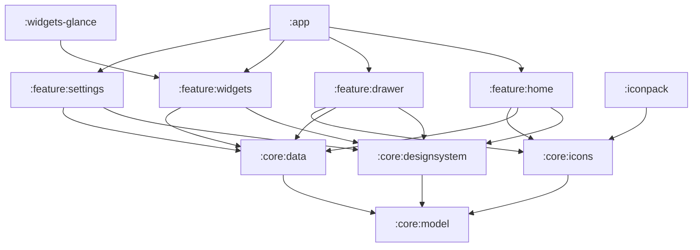

# Saber-Theme architecture

Minimalist "liquid glass" home-screen launcher for the Galaxy S23 (API 36,
One UI 8.5), with themed widgets and a matching icon pack. Kotlin + Jetpack
Compose, Hilt, coroutines/Flow, Gradle version catalog.

## Product decisions
- The launcher **draws its own wallpaper**, so every glass element can blur
  and refract what is behind it.
- Widgets: **native Compose glass widgets** inside the launcher, plus
  **Glance widgets** exported for other launchers (frosted-tint fallback,
  since RemoteViews cannot blur).
- Icons: **built in**, plus a standalone **icon-pack APK** in the ADW/Nova
  `appfilter.xml` format.

## Modules



| Module | Responsibility |
|---|---|
| `:app` | `HomeActivity` (MAIN/HOME, `singleTask`), nav host, Hilt root, wiring |
| `:core:designsystem` | Tokens, `GlassSurface`, typography, AGSL shaders, theme |
| `:core:model` | Pure Kotlin: `AppEntry`, `HomeLayout` (`HomePage`, `Placed`, `HomeItem`, `WidgetType`), policy, codec |
| `:core:data` | DataStore (layout, prefs), `AppRepository` (LauncherApps), wallpaper store |
| `:core:icons` | Vector glyphs, `ComponentName` → glyph map, monochrome fallback |
| `:feature:home` | Pager, grid, dock, edit mode, folders |
| `:feature:drawer` | App drawer and search |
| `:feature:widgets` | Native widget composables and `WidgetDataSource` implementations |
| `:feature:settings` | Wallpaper, glass intensity, grid size, icon options |
| `:widgets-glance` | Exported AppWidgets (Glance), reusing the widgets data layer |
| `:iconpack` | Separate `applicationId` APK; `appfilter.xml` generated from `:core:icons` |

**Dependency rule:** `feature:*` → `core:*` only. Features never depend on
each other; `:app` composes them. (`:widgets-glance` depends on the data
layer of `:feature:widgets`; if that grows, move the sources to
`:core:widgetdata`.)

## Layers
- Unidirectional data flow: Composable ← `StateFlow<UiState>` (ViewModel)
  ← repositories ← sources.
- Persistence: DataStore for layout and settings. One UI may kill or reset
  the launcher, so no state lives only in memory.
  - `SettingsRepository`: glass intensity and `WallpaperChoice`
    (`Bundled(id)` | `Photo(fileName)`).
  - `LayoutRepository`: `HomeLayout(dock, pages: List<HomePage>)`, each
    page a list of `Placed(item, col, row, spanX, spanY)` with
    `HomeItem.App | Folder | Widget(widgetId, WidgetType, config)`, in the
    line-based `HomeLayoutCodec` v2 format. v1 (M1) layouts migrate on read:
    dock kept, first page placed in reading order, default widget page
    prepended, later pages dropped (those apps live in the drawer).
  - `WallpaperStore`: imported photos copied to `filesDir/wallpapers` as
    WebP (long edge <= 3072 px); the picker grant is temporary.
- `HomeLayoutPolicy` (pure Kotlin, tested) builds the curated first-run
  layout: dock from phone/messages/browser/camera glyphs; page 1 widgets
  (Clock 4x2, Weather 2x2, Calendar 2x2, Battery 2x1, Alarm 2x1; Media is
  picker-only since it needs listener access); page 2 a Social folder + up
  to 15 apps from `USEFUL_GLYPHS`. `reconcile` only removes uninstalled
  apps (never appends, never adds or removes pages) and keeps apps of
  locked/paused profiles (`AppRepository.Installed.lockedProfiles`). Edit
  helpers: `firstFreeSpot`, `add`, `move`, `remove`, `makeFolder`.
- Apps: `LauncherApps` + `LauncherApps.Callback` → `AppRepository`, so work
  profile and Secure Folder apps appear (see `.claude/rules/launcher-manifest.md`).

## Glass rendering pipeline
The main technical risk; constraints live in `.claude/rules/glass-rendering.md`.

1. `WallpaperLayer` at the root draws the wallpaper, offset by parallax.
   Aurora Night/Dawn are drawn procedurally from the Figma blob recipe at
   window size + 28 dp overscan; photos are centre-cropped to the same size.
2. `GlassBackdrop.render` (off the main thread, once per wallpaper and
   window size) downsamples 4x and box-blurs one copy per material, and
   builds a `WallpaperPalette` (12x26 luminance/colour grid). Photos get the
   dark theme when their mean luminance is below 0.25.
3. `GlassSurface(shape, material, onClick, onLongClick)` is a
   `Modifier.Node` that tracks its window position and runs one AGSL
   `RuntimeShader` (API 33+) pass over its own bounds: rounded-rect SDF,
   edge refraction into the blurred copy, adaptive tint, lit specular rim,
   border and press bloom. Uniforms are pushed only when they change.
4. Material tokens: `blurRadius`, `tint`, `tintAlpha`, `refraction`,
   `highlight`, `borderAlpha`; presets `thin`, `regular`, `thick`.
5. Engine: **own AGSL shader** (spike 2026-10-09, `benchmark` build on the
   S23, 20 Thin tiles + Regular widget + Thick dock, pager swipes):
   frame p50 5 ms / p90 6 ms / p95 6 ms, GPU 3 ms, jank 1.5% (slow UI
   thread frames; target < 1% is a home-screen task). Kyant `backdrop` was
   not benchmarked: it records and blurs content live each frame, which the
   cached-backdrop rule rules out. Revisit only for live overlay blur.
   Real home (step 6, 7 pages, ~25 glass nodes on screen, labels, tilt,
   adaptive tint): p50 7 ms / p90 9 ms, jank 2.3%. Every glass node must
   re-record each frame while paging (its backdrop offset changes), so
   per-node CPU cost is the budget; uniforms are pushed only on change and
   tint solves are cached.
   M2 step 1 (Perfetto + simpleperf, same 7-page layout, 12 swipes):
   - Compiled shaders come from a process-wide pool (`GlassPrograms`,
     pre-warmed with 56 off the main thread in `BackdropLoader`); compiling
     AGSL per new tile cost ~0.5 ms each on a page's first frame.
   - Glyphs draw from `GlyphImages` (rasterised once per size) instead of
     `painterResource` vectors, which re-rasterised per composition.
   - `GlassSurface` layers: `dropShadow → [layer] glass → [layer] content`,
     so the per-frame parallax re-record touches only the glass rect.
   - Result: p50 5–6 ms / p90 7–8 ms / p99 10–13 ms, GPU 3 ms, jank
     1.0–1.3% (was 2.2%). Every remaining slow frame is the first frame of a
     swipe, when the incoming page records for the first time (~7.5 ms for
     20 cells, ~350 µs each, spread across Compose node draw). Keeping
     neighbours composed (`beyondViewportPageCount = 1`) made it worse
     (1.9%): the spike moves to mid-swipe and off-screen glass re-records.
     Step 2 (2-page curated home, placeholder widgets): jank 0.2–0.3%,
     p90 6 ms; most of the 12 swipes now hit the edge. Re-check with real
     widgets (step 4).
   - The `benchmark` build is profileable and not obfuscated
     (`app/src/benchmark`, `benchmark-rules.pro`) for `simpleperf --app`.
6. Glance fallback maps the same tokens to a translucent tinted rounded
   background with a 1 px border.

## Living glass
The glass reacts to touch, tilt, motion and what is behind it, without
being busy or costly.

1. **Glass answers every touch.** `Modifier.glassPress`: press compresses
   (spring, 4%), light blooms from the finger in the shader, haptic tick;
   release overshoots slightly (`GlassMotion.release`, damping 0.6).
2. **Light comes from the world.** `TiltSensor` (game rotation vector,
   `SENSOR_DELAY_GAME`, low-pass, slowly drifting rest pose) moves the
   virtual light, which drives the rim highlight, and adds tilt parallax.
3. **Nothing teleports.** Every change uses a `GlassMotion` spring: folders
   grow from their tile, menus from the touch point, sheets from below.
4. **Glass adapts to what's behind it.** `TintSolver` picks the lowest tint
   alpha that keeps primary text >= 4.5:1 over the palette sample under each
   surface (results cached per quantised rect).
5. **Alive, never busy.** `EffectsPolicy` (pure Kotlin, tested) is Active
   only within 3 s of a touch while resumed; Idle turns the sensor off;
   Power Saving / thermal >= moderate halve effects and turn the sensor
   off; "Remove animations" snaps springs. The user intensity slider scales
   refraction, rim and bloom.
6. **Draw-phase only.** Tilt, parallax, press and intensity are snapshot
   state in `GlassEnvironment` / `GlassPressState`, read only in draw,
   `graphicsLayer` or node draw code, so motion never recomposes.

```
GlassEnvironment (CompositionLocal, HomeActivity root)
 ├─ backdrop      ← BackdropLoader(BackdropSource.Aurora | Photo)
 ├─ light         ← TiltSensor
 ├─ parallax      = tiltParallax + pageParallax (clamped to overscan)
 ├─ intensity     ← GlassEffectsController(EffectsPolicy, user slider)
 ├─ reducedMotion ← ANIMATOR_DURATION_SCALE == 0
 └─ effects       ← Glass Lab switches (debug and benchmark builds)
```

Overlays (open folder) blur the home content with a layer `BlurEffect`
only while visible; glass itself never blurs live.

## Home
- `HomeScreen`: pager of positioned 4x5 grids (72 dp app cells spread edge
  to edge, 56 dp Thin tiles, 18 dp margin; widgets align with the tiles'
  outer edges with 12 dp gaps), morphing page indicator, search pill
  (visual only until the drawer), Thick dock of four apps. Widgets render
  through the `widgetContent` slot (placeholder until `:feature:widgets`).
- Long-press empty space: menu with Wallpaper & style / Launcher settings
  (open `HomeOptionsSheet`: wallpapers, photo import, intensity, Glass Lab);
  Edit home screen and Widgets are M2. Long-press an app: App info.
- Launch: `LauncherApps.startMainActivity` with a clip-reveal from the
  icon's window bounds.
- Home is curated; every app lives in the drawer (M2 step 5). Apps of a
  locked profile keep their slot and are hidden until it unlocks.

## Widget system
- `WidgetDataSource<T>` exposes `Flow<WidgetState<T>>` (Loading, Ready,
  NeedsPermission, Error).
- Sizes on the cell grid: 2×1, 2×2, 4×1, 4×2.
  `HomeItem.Widget` + its `Placed` span is stored in the layout;
  `WidgetType.sizes` lists the allowed sizes (first = default).

| Widget | Source | Permission / access |
|---|---|---|
| Clock | system time ticker | none |
| Date / Calendar | `CalendarContract` | `READ_CALENDAR` |
| Weather | Open-Meteo (no API key) | `ACCESS_COARSE_LOCATION`, `INTERNET` |
| Battery | sticky `ACTION_BATTERY_CHANGED` | none |
| Media | `MediaSessionManager` | notification listener access |
| Next alarm | `AlarmManager.nextAlarmClock` | none |

Glance widgets reuse the same sources, refreshed by WorkManager plus
broadcast triggers (time, battery, alarm changed).

## Icon system
- Glyphs live in `design/icons/glyphs.js` (24-unit grid, 1.75 stroke,
  round caps), the single source for Figma and Android.
  `node tools/build-icons.mjs` generates `glyph_*.xml` VectorDrawables and
  `GeneratedGlyphs.kt` (`AppGlyph`, `UiGlyph`, package map from
  `design/icons/packages.json`); `node tools/build-plugin.mjs` bundles the
  Figma plugin into `design/figma-plugin/dist/code.js`.
- Rendering: glyph centred on a glass squircle, or bare-glyph mode.
- Lookup order: mapped glyph → adaptive-icon monochrome layer → generated
  letter glyph.
- `:iconpack` packages the same drawables with generated `appfilter.xml`
  and `drawable.xml`.

## Design source
The Figma file "Saber-Theme" (Foundations, Components, Widgets, Icon pack,
Screens) is the visual source of truth. Frames are 360×780 dp (S23 at ~3x).
